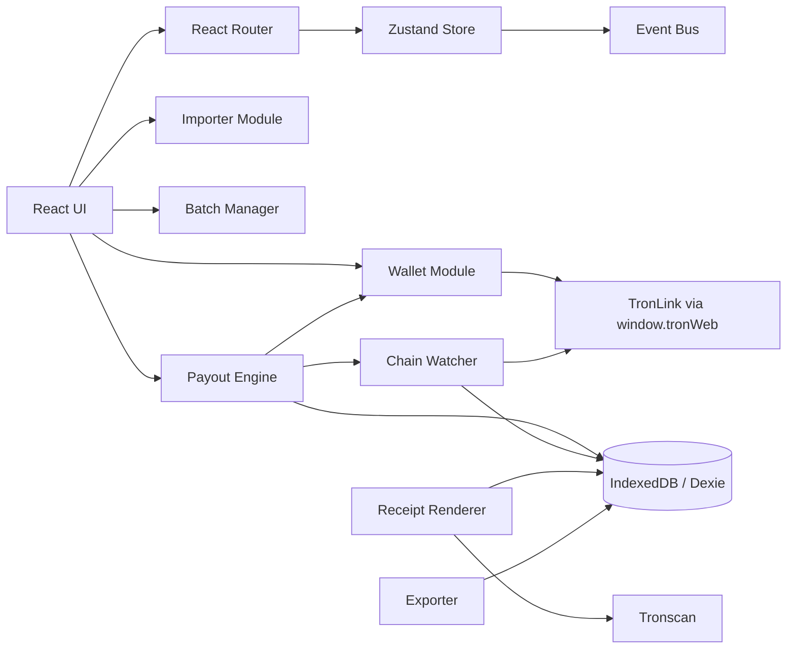
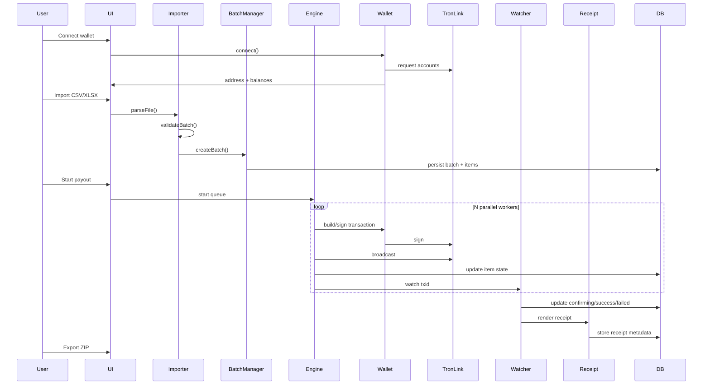
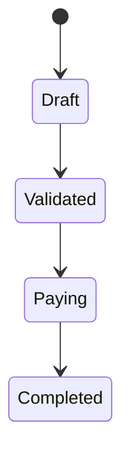
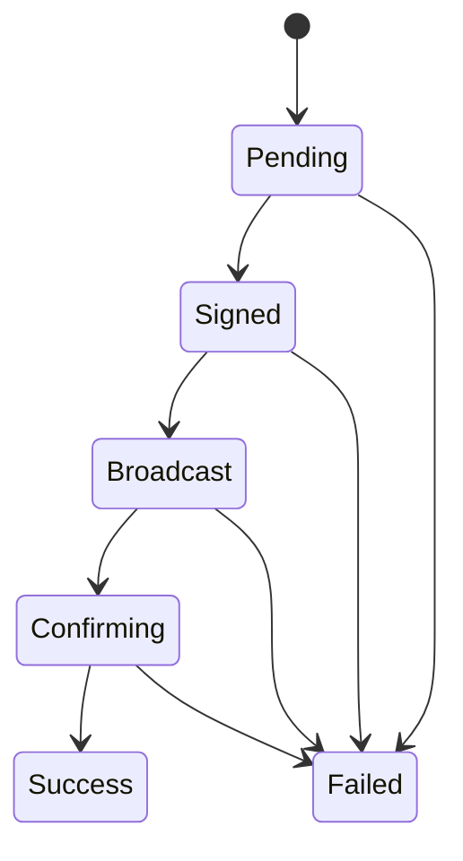

# TRC Mass Payout Architecture

## 1. Architecture Summary

The application is a client-side, self-custodial React SPA deployed on Vercel. TronLink provides signing through `window.tronWeb`, IndexedDB stores operational state through Dexie.js, and an internal payout engine coordinates validation, execution, watching, and receipt export. The design is intentionally prepared for two payout modes, while V1 implements only Mode B.

## 2. High-Level Module Map

## 3. Execution Sequence

## 4. State Models

### 4.1 Batch Lifecycle

### 4.2 Payout Item State Machine

## 5. Core Modules

### 5.1 Wallet

Responsibilities:

- Detect TronLink and `window.tronWeb`
- Connect and disconnect wallet sessions
- Read address, network, TRX, and USDT balances
- Estimate readiness for energy and bandwidth
- Delegate signing to TronLink only

### 5.2 Importer

Responsibilities:

- Parse CSV and XLSX
- Normalize columns to internal payout item shape
- Validate Base58Check address format
- Validate USDT precision
- Detect duplicates and zero-value issues
- Run batch budget checks before execution

### 5.3 BatchManager

Responsibilities:

- Create and persist batches
- Update lifecycle status
- List, query, and resume batches
- Record audit events for every state transition

### 5.4 PayoutEngine

Responsibilities:

- Manage configurable concurrency
- Build, sign, broadcast, and checkpoint each payout item
- Enforce idempotency rules
- Hand confirmed transactions to receipt generation

### 5.5 ChainWatcher

Responsibilities:

- Poll transaction status
- Transition items from `Broadcast` to `Confirming` to terminal states
- Handle confirmation timeout logic
- Resume from persisted in-flight transactions after refresh

### 5.6 ReceiptRenderer

Responsibilities:

- Render receipt views to PNG with `html2canvas`
- Generate PDF using `jsPDF`
- Produce SHA256 checksum
- Store receipt metadata for export

### 5.7 Exporter

Responsibilities:

- Build ZIP-ready export payloads
- Export normalized CSV snapshots
- Bundle receipts, summary metadata, and audit trail

## 6. Client State Management

### 6.1 Zustand Store

Zustand holds active UI state:

- connected wallet state
- selected batch
- current queue metrics
- filter and search UI state
- settings including concurrency and confirmation policy

### 6.2 Event Bus

An internal event bus decouples modules and UI updates:

- `wallet.connected`
- `wallet.disconnected`
- `batch.created`
- `batch.validated`
- `payout.signed`
- `payout.broadcast`
- `payout.confirming`
- `payout.success`
- `payout.failed`
- `receipt.generated`
- `export.completed`

## 7. IndexedDB Schema

All operational persistence is stored through Dexie tables.

### 7.1 `batches`

Fields:

- `id`: UUID primary key
- `name`: batch label
- `sourceFileName`: original import file name
- `lifecycle`: `Draft | Validated | Paying | Completed`
- `status`: human-readable aggregate status
- `network`: target network string
- `senderAddress`: connected sender address
- `tokenSymbol`: `USDT`
- `tokenContract`: TRC-20 contract address reference
- `totalCount`: total imported rows
- `validCount`: valid rows
- `invalidCount`: invalid rows
- `successCount`: confirmed success rows
- `failedCount`: terminal failed rows
- `totalAmount`: decimal string
- `estimatedEnergy`: numeric estimate
- `estimatedBandwidth`: numeric estimate
- `concurrency`: worker count
- `startedAt`: ISO timestamp nullable
- `completedAt`: ISO timestamp nullable
- `createdAt`: ISO timestamp
- `updatedAt`: ISO timestamp

Indexes:

- `id`
- `lifecycle`
- `createdAt`
- `updatedAt`

### 7.2 `payout_items`

Fields:

- `id`: UUID primary key
- `batchId`: parent batch UUID
- `lineNumber`: source row number
- `recipient`: full recipient address
- `maskedRecipient`: masked form for quick display
- `amount`: decimal string
- `reference`: optional local reference
- `status`: `Pending | Signed | Broadcast | Confirming | Success | Failed`
- `errorCode`: nullable normalized error code
- `errorMessage`: nullable message
- `txId`: nullable on-chain transaction identifier
- `explorerUrl`: nullable Tronscan URL
- `idempotencyKey`: deterministic UUID or imported UUID
- `attemptCount`: retry counter
- `signedAt`: ISO timestamp nullable
- `broadcastAt`: ISO timestamp nullable
- `confirmedAt`: ISO timestamp nullable
- `createdAt`: ISO timestamp
- `updatedAt`: ISO timestamp

Indexes:

- `id`
- `batchId`
- `[batchId+status]`
- `recipient`
- `txId`
- `idempotencyKey`
- `updatedAt`

### 7.3 `receipts`

Fields:

- `id`: UUID primary key
- `batchId`: parent batch UUID
- `payoutItemId`: related payout item UUID
- `txId`: transaction id
- `sender`: sender address
- `recipient`: recipient address
- `maskedRecipient`: masked display address
- `amount`: decimal string
- `network`: `TRON Mainnet`
- `status`: `Success`
- `checksumSha256`: checksum string
- `pngDataUrl`: PNG data URL or blob reference
- `pdfDataUrl`: PDF data URL or blob reference
- `qrValue`: Tronscan URL encoded in QR
- `generatedAt`: ISO timestamp
- `timezone`: local timezone string

Indexes:

- `id`
- `batchId`
- `payoutItemId`
- `txId`
- `generatedAt`

### 7.4 `audit_logs`

Fields:

- `id`: UUID primary key
- `batchId`: nullable batch UUID
- `payoutItemId`: nullable payout item UUID
- `action`: event name
- `fromStatus`: nullable previous status
- `toStatus`: nullable next status
- `actor`: `system | user | wallet`
- `message`: detail message
- `metadataJson`: serialized structured metadata
- `createdAt`: ISO timestamp

Indexes:

- `id`
- `batchId`
- `payoutItemId`
- `action`
- `createdAt`

### 7.5 `wallet_cache`

Fields:

- `address`: primary key
- `network`: network label
- `trxBalanceSun`: TRX balance in sun as string
- `usdtBalance`: decimal string
- `energyAvailable`: number
- `bandwidthAvailable`: number
- `lastSyncedAt`: ISO timestamp

Indexes:

- `address`
- `network`
- `lastSyncedAt`

## 8. Concurrency Control

- The payout queue uses a configurable `N` parallel worker model.
- `N` defaults to a conservative value and can be changed in settings.
- Each worker pulls the next eligible `Pending` item after checking IndexedDB status.
- Workers must stop when wallet connectivity or balance prerequisites fail.
- Queue metrics are emitted through Zustand and the event bus.

## 9. Idempotency Strategy

- Every payout item has an `idempotencyKey`.
- Before build or broadcast, the engine checks IndexedDB for existing terminal success or non-terminal in-flight state.
- If `txId` already exists for an item, the system resumes watcher flow instead of rebuilding a new transaction.
- Resume logic prevents duplicate broadcast after crash or reload.

## 10. Crash Recovery

- On application boot, `BatchManager` scans for batches in `Paying`.
- `PayoutEngine` queries `payout_items` in `Signed`, `Broadcast`, or `Confirming`.
- Items with `txId` re-enter watcher mode immediately.
- Items signed but not broadcast are marked for safe review or retry according to local checkpoint integrity.
- Queue progress reconstructs from IndexedDB rather than in-memory state.

## 11. Payout Engine Abstraction

### 11.1 Interface

The engine depends on a `PayoutProvider` interface:

- `buildTransaction`
- `sign`
- `broadcast`
- `getStatus`

### 11.2 Mode B Implementation

Mode B uses TronLink and `window.tronWeb` directly:

- build TRC-20 transfer call
- request signature from wallet
- broadcast through TronLink/TronWeb
- fetch status from chain APIs exposed via TronWeb

### 11.3 Mode A Stub

Mode A remains a stubbed provider for future expansion. The interface is preserved now to avoid rework in orchestration and storage layers.

## 12. Deployment

- Target platform: Vercel
- Build command: `npm run build`
- Output directory: `dist`
- SPA route rewriting is handled through `vercel.json`
